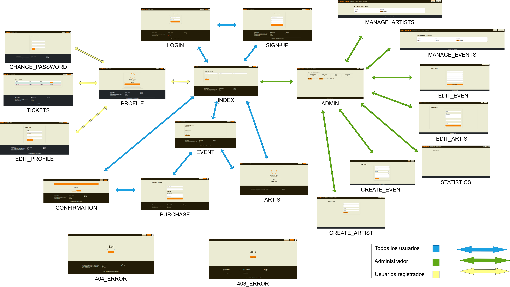
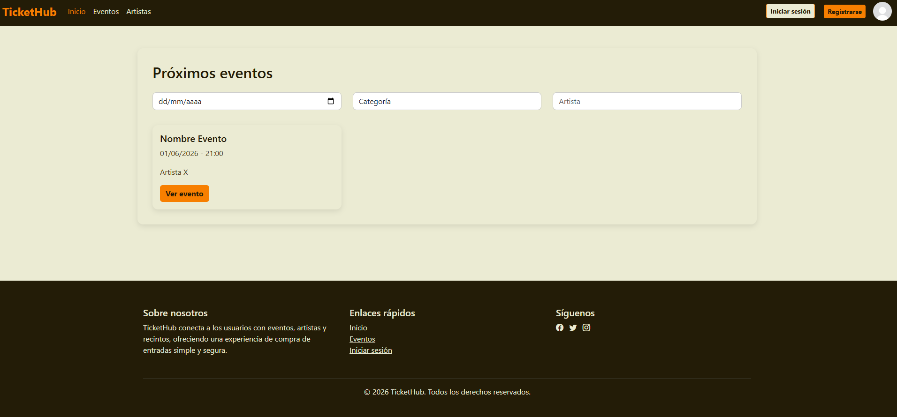
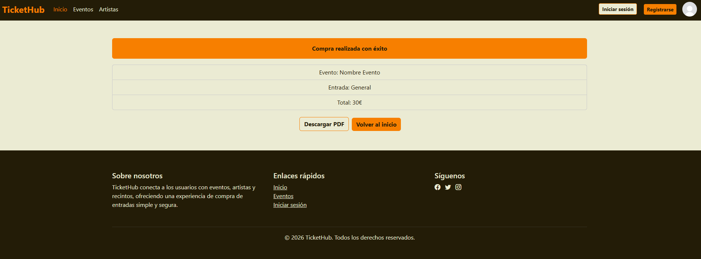
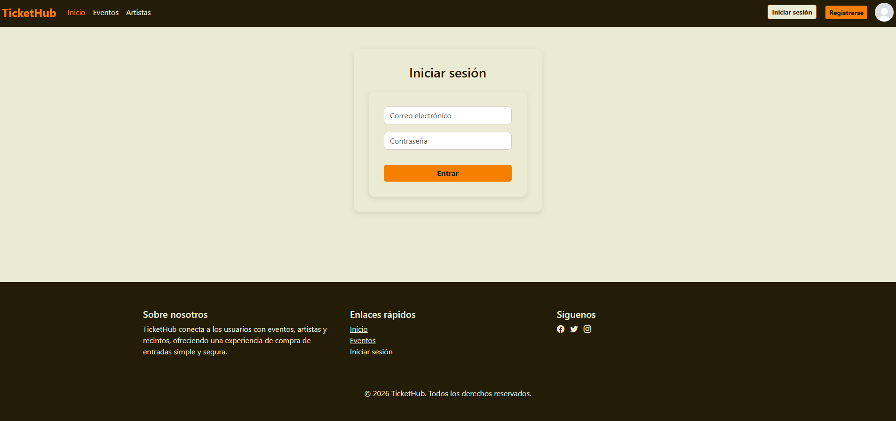
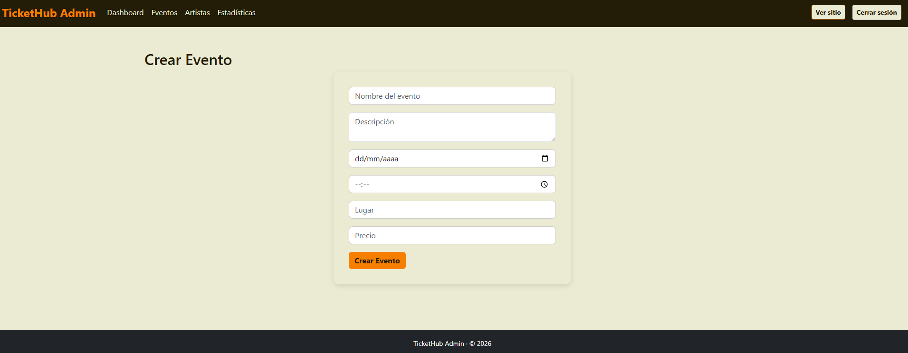
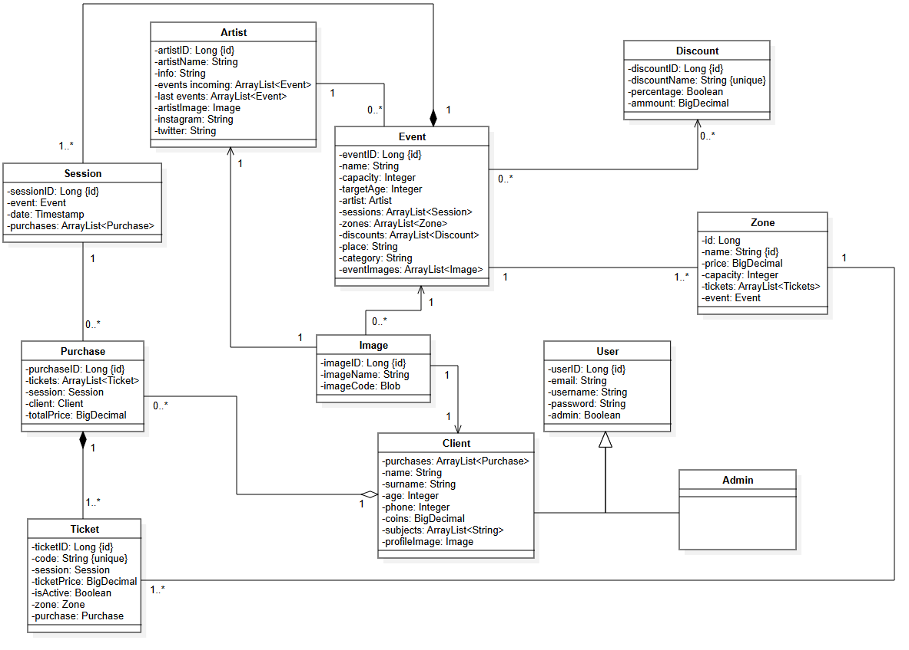

# TicketHub

## 👥 Miembros del Equipo
| Nombre y Apellidos | Correo URJC | Usuario GitHub |
|:--- |:--- |:--- |
| Rubén Alcojor Patilla | r.alcojor.2022@alumnos.urjc.es | rualpa2004 |
| Daniel Bonachela Martínez | d.bonachela.2022@alumnos.urjc.es | fuihfuefuiewn |
| Shania Manso García | s.manso.2022@alumnos.urjc.es | shaniaconx |
| Alejandro Valor González | a.valor.2022@alumnos.urjc.es | AtilaVG |
| Ronald Sebastián Silvera Llimpe | rs.silvera.2022@alumnos.urjc.es | D4ng3r25 |

---

## 🎭 **Preparación 1: Definición del Proyecto**

### **Descripción del Tema**
TicketHub es una plataforma web de gestión y venta de entradas para eventos, perteneciente al sector del ocio y los espectáculos. Permite a los usuarios consultar y filtrar eventos, comprar entradas y gestionar su histórico de compras, mientras que los administradores pueden crear y gestionar eventos, artistas y recintos. La aplicación aporta valor al usuario ofreciendo una experiencia centralizada, sencilla y segura para descubrir eventos y adquirir entradas digitales.

### **Entidades**
Entidades principales que gestionará la aplicación y las relaciones entre ellas:

1. **User**: Usuario registrado en la plataforma.
2. **Event**: Evento disponible para la venta de entradas.
3. **Artist**: Artista o grupo que realiza uno o varios eventos.
4. **Ticket**: Entrada asociada a un evento y comprada por un usuario.

**Relaciones entre entidades:**
- User - Ticket: Un usuario puede comprar múltiples entradas y cada entrada pertenece a un único usuario (1:N)
- Event - Ticket: Un evento puede tener múltiples entradas asociadas y cada entrada corresponde a un único evento (1:N)
- Artist - Event: Un artista puede realizar múltiples eventos y cada evento tiene un único artista principal (1:N)
- User - Event: Un usuario puede asistir a múltiples eventos a través de las entradas compradas (N:M, implícita mediante Ticket)

### **Permisos de los Usuarios**
Permisos de cada tipo de usuario y entidades de las que es dueño:

* **Usuario Anónimo**: 
  - Permisos: Consulta y filtrado de eventos, visualización de información de eventos y artistas
  - No es dueño de ninguna entidad

* **Usuario Registrado**: 
  - Permisos: Compra de entradas, gestión de su perfil, visualización de su histórico de compras
  - Es dueño de: Sus propios Tickets y su Perfil de Usuario

* **Administrador**: 
  - Permisos: Creación, edición y eliminación de eventos y artistas, control de aforo y visualización de estadísticas
  - Es dueño de: Events, Artists y puede gestionar todos los Tickets y Users

### **Imágenes**
Entidades que tienen asociadas una o varias imágenes:

- **User**: Una imagen de perfil por usuario
- **Event**: Una imagen principal o cabecera representativa del evento
- **Artist**: Una imagen para la página pública del artista

### **Gráficos**
Información mostrada usando gráficos y tipo de gráficos:

- **Gráfico 1**: Entradas vendidas en cada mes por los diferentes eventos – Gráfico de barras
- **Gráfico 2**: Ranking de eventos más vendidos – Gráfico de barras horizontales
- **Gráfico 3**: Evolución de entradas vendidas en la plataforma a lo largo del tiempo – Gráfico de líneas

### **Tecnología Complementaria**
Tecnología complementaria empleada:

- Envío de correos electrónicos automáticos de confirmación de compra mediante JavaMailSender
- Generación de entradas en formato PDF tras la compra usando iText

### **Algoritmo o Consulta Avanzada**
Algoritmo o consulta avanzada que implementada:

- **Algoritmo/Consulta**: Control automático de aforo, ranking de eventos más vendidos y recomendaciones personalizadas de eventos según usuarios similares.
- **Descripción**: El sistema gestionará de forma automática el aforo de cada evento, controlando el número de entradas vendidas y bloqueando nuevas compras cuando se alcance la capacidad máxima permitida.
Además, se generará un ranking de eventos en función del total de entradas vendidas, ordenados de mayor a menor, con el objetivo de mostrar estadísticas, tendencias y eventos destacados.
Por último, el sistema ofrecerá recomendaciones personalizadas a cada usuario mediante el análisis de perfiles con gustos similares, sugiriendo eventos a los que estos usuarios hayan asistido previamente.
- **Alternativa**: Consulta avanzada que agrupe las entradas vendidas por evento y por periodo de tiempo, permitiendo analizar la evolución y las tendencias de ventas.

---

## 🛠 **Preparación 2: Maquetación de páginas con HTML y CSS**

### **Vídeo de Demostración**
📹 **[Enlace al vídeo en YouTube](https://youtu.be/Pj7w63RsNdY)**

> Vídeo mostrando las principales funcionalidades de la aplicación web.

### **Diagrama de Navegación**
Diagrama que muestra cómo se navega entre las diferentes páginas de la aplicación:



> [Descripción opcional del flujo de navegación: Ej: "El usuario puede acceder desde la página principal a todas las secciones mediante el menú de navegación. Los usuarios anónimos solo tienen acceso a las páginas públicas, mientras que los registrados pueden acceder a su perfil y panel de usuario."]

### **Capturas de Pantalla y Descripción de Páginas**
**Nota general (páginas públicas)**  
Todas las páginas públicas comparten el mismo header (marca TicketHub, navegación Inicio/Eventos/Artistas, botones Iniciar sesión y Registrarse) y el mismo footer (texto, Sobre nosotros, enlaces rápidos y redes sociales).

#### **1. Página Principal / Home**

La página de inicio muestra el título ‘Próximos eventos’, tres filtros (fecha, categoría y artista) y una cuadrícula de tarjetas de evento con imagen, nombre, fecha y hora, artista y un botón para ver el detalle

#### **2. Página Eventos**

Ficha de evento con fecha, hora y lugar destacados, texto descriptivo, enlace para ver al artista y bloque de compra con precio y botón “Comprar entrada”

#### **3. Página de Confirmación**

Mensaje de compra exitosa con alerta de confirmación, lista de resumen (evento, tipo de entrada, total) y botones para descargar PDF o volver al inicio

#### **4. Página Artista**

Perfil del artista con foto circular, biografía corta, lista de próximos eventos y botones hacia redes sociales (Instagram/Twitter).

#### **5. Página de Inicio de Sesión**

Formulario centrado de inicio de sesión con campos de correo y contraseña y botón “Entrar”.

#### **6. Página de Compra**

Formulario de compra con selector de tipo de entrada, cantidad, cálculo de total y sección de pago (número de tarjeta, titular) más botón “Confirmar compra”.

#### **7. Página Registro**

Formulario de registro con campos de nombre, correo, contraseña y confirmación, botón “Registrarse”.

#### **8. Página Error 403**

Pantalla de acceso no autorizado con código 403, mensaje “Acceso no autorizado” y botón para volver al inicio.

#### **9. Página Error 404**

Pantalla de página no encontrada con código 404, mensaje “Página no encontrada” y botón para volver al inicio.

#### **10. Página Administrador**

Panel con KPIs en tarjetas (entradas vendidas, eventos activos, usuarios, próximos eventos) y botones para crear/gestionar eventos y artistas o ver estadísticas.

#### **11. Página Crear Artista**

Formulario para crear artista con campos de nombre, biografía, Instagram y Twitter, y botón “Crear Artista”.

#### **12. Página Crear Evento**

Formulario de alta de evento con campos de nombre, descripción, fecha, hora, lugar y precio, botón “Crear Evento”

#### **13. Página Editar Artista**

Formulario de edición de artista con campos precargados de nombre, biografía e identificadores de redes, botón “Guardar cambios”.

#### **14. Página Editar Evento**

Formulario de edición de evento con datos cargados (nombre, descripción, fecha, hora, lugar, precio) y botón “Guardar Cambios”.

#### **15. Página Administrar Artistas**

Tabla de artistas con acciones de editar y eliminar, dentro del panel admin.

#### **16. Página Administrar Eventos**

Tabla de eventos con acciones de editar y eliminar, dentro del panel admin.mocional. Incluye barra de navegación y acceso a registro/login para usuarios no autenticados."

#### **17. Página de Estadísticas Administrador**

Vista de estadísticas con dos gráficos (placeholders) para ventas y usuarios, accesible desde el panel admin.
---

## 🛠 **Práctica 1: Web con HTML generado en servidor y AJAX**

### **Vídeo de Demostración**
📹 **[Enlace al vídeo en YouTube](https://www.youtube.com/watch?v=x91MPoITQ3I)**
> Vídeo mostrando las principales funcionalidades de la aplicación web.

### **Navegación y Capturas de Pantalla**

#### **Diagrama de Navegación**

Solo si ha cambiado.

#### **Capturas de Pantalla Actualizadas**

Solo si han cambiado.

### **Instrucciones de Ejecución**

#### **Requisitos Previos**
- **Java**: versión 21 o superior
- **Maven**: versión 4.0.0 o superior
- **MySQL**: versión 8.0 o superior
- **Git**: para clonar el repositorio

#### **Pasos para ejecutar la aplicación**

1. **Clonar el repositorio**
   ```bash
   git clone https://github.com/[usuario]/[nombre-repositorio].git
   cd [nombre-repositorio]
   ```

2. **AQUÍ INDICAR LO SIGUIENTES PASOS**

#### **Credenciales de prueba**
- **Usuario Admin**: usuario: `adminEmail@gmail.com `, contraseña: `admin`
- **Usuario Registrado**: usuario: `pepe@gmail.com`, contraseña: `pepe123`

### **Diagrama de Entidades de Base de Datos**

Diagrama mostrando las entidades, sus campos y relaciones:



> [Descripción opcional: Ej: "El diagrama muestra las 4 entidades principales: Usuario, Producto, Pedido y Categoría, con sus respectivos atributos y relaciones 1:N y N:M."]

### **Diagrama de Clases y Templates**

Diagrama de clases de la aplicación con diferenciación por colores o secciones:


> [Descripción opcional del diagrama y relaciones principales]

### **Participación de Miembros en la Práctica 1**

#### **Alumno 1 - [Rubén Alcojor Patilla]**

[Desarrolo de archivos backend (controllers, services y repositories), creación de la base de datos, operaciones CRUD de objetos de la base de datos desde la web, creación de archivos javascript para dinamizar el frontend, maquetación de HTML e inicialización de la base de datos]

| Nº    | Commits      | Files      |
|:------------: |:------------:| :------------:|
|1| [Cambiamos controllers, entities, services y repositories para poder unirlo al frontend](https://github.com/CodeURJC-DAW-2025-26/practica-daw-2025-26-grupo-10/commit/f44e798c742781b07b95058cfa8d46d60e447ade)  | [UserController.java](backend/tickethub/src/main/java/es/tickethub/tickethub/controllers/UserController.java)   |
|2| [Editando los html para poder unirlos al backend](https://github.com/CodeURJC-DAW-2025-26/practica-daw-2025-26-grupo-10/commit/4367031c45d867c37a255c8571b9880d6542d3b2)  | [create_event.html](backend/tickethub/src/main/resources/templates/admin/events/create_event.html)   |
|3| [Operaciones CRUD de sesion, crear y editar eventos](https://github.com/CodeURJC-DAW-2025-26/practica-daw-2025-26-grupo-10/commit/1155991c9485fea5d49be65f116ffec42500f38c)  | [SessionController.java](backend/tickethub/src/main/java/es/tickethub/tickethub/controllers/SessionController.java)   |
|4| [Entities y base de datos funcionando](https://github.com/CodeURJC-DAW-2025-26/practica-daw-2025-26-grupo-10/commit/5b4f0c77923954db8747a3f522b41e025a6cca52)  | [Event.java](backend/tickethub/src/main/java/es/tickethub/tickethub/entities/Event.java)   |
|5| [Aplicar mustache en todos los html de la carpeta public y cambios en el database initializer](https://github.com/CodeURJC-DAW-2025-26/practica-daw-2025-26-grupo-10/commit/7357f654bd8168b119dce9639be50bf4ee12b5f1)  | [DataBaseInitializer.java](backend/tickethub/src/main/java/es/tickethub/tickethub/services/DataBaseInitializer.java)   |

---

#### **Alumno 2 - [Shania Manso García]**

[Desarrolo de archivos backend(controllers, entities, repositories), desarrollo de la lógica para comprar, ayuda en la parte de frontend y en la generación de PDF y QR]

| Nº    | Commits      | Files      |
|:------------: |:------------:| :------------:|
|1| [Implementación de gráficos dinámicos](https://github.com/CodeURJC-DAW-2025-26/practica-daw-2025-26-grupo-10/commit/2395b4b5cf4957eaa4ea4625ed8df63e3c3e666d#diff-cf92a01b3294c38598fff05cacb7247c15c1a6eed87f161d2410cdc7cb23357f)  | [stats-charts.js](backend/tickethub/src/main/resources/static/js/stats-charts.js)   |
|2| [Funcionalidad cargar más en las páginas events y artist desarrollada](https://github.com/CodeURJC-DAW-2025-26/practica-daw-2025-26-grupo-10/commit/d711f25500e7051bb9eb2b43874502ce9d684bff)  | [loadArtists.js](backend/tickethub/src/main/resources/static/js/loadArtists.js)   |
|3| [Implementación del carrusel](https://github.com/CodeURJC-DAW-2025-26/practica-daw-2025-26-grupo-10/commit/17f723b54afa9b35ba5e8edbf1d521a0c893afe5)  | [carousel.js](backend/tickethub/src/main/resources/static/js/carousel.js)   |
|4| [Implementación de la lógica de compra](https://github.com/CodeURJC-DAW-2025-26/practica-daw-2025-26-grupo-10/commit/03dfd03802e673838988569c899bdff393f6ee7b)  | [PurchaseService.java](backend/tickethub/src/main/java/es/tickethub/tickethub/services/PurchaseService.java)   |
|5| [Formateo y lograr que funcione la creación de tickets](https://github.com/CodeURJC-DAW-2025-26/practica-daw-2025-26-grupo-10/commit/6675bd38690ef1aad4f505ef7e617dcc07dcc79c)  | [PurchaseController.java](backend/tickethub/src/main/java/es/tickethub/tickethub/controllers/PurchaseController.java)   |

---

#### **Alumno 3 - [Daniel Bonachela Martínez]**

[Desarrolo de archivos backend (Controllers, services y repositories), desarrolo del algoritmo avanzado (recomendaciones personalizadas), ayuda en frontend, limpieza y revisión del código]

| Nº    | Commits      | Files      |
|:------------: |:------------:| :------------:|
|1| [Implementación de la consulta avanzada de recomendación de eventos](https://github.com/CodeURJC-DAW-2025-26/practica-daw-2025-26-grupo-10/commit/5ba4850b250124de1fed15f30d2395555b099632)  | [ClientRecommendationService.java](backend/tickethub/src/main/java/es/tickethub/tickethub/services/ClientRecommendationService.java)   |
|2| [Desarrollo de controller, service y repository de Event y controller de Artist](https://github.com/CodeURJC-DAW-2025-26/practica-daw-2025-26-grupo-10/commit/63dbfee6e857f89393a252fd4e95f86c2b0f4ece)  | [EventController.java](backend/tickethub/src/main/java/es/tickethub/tickethub/controllers/EventController.java)   |
|3| [Desarrollo de controller, entitie, service y repository de Artist](https://github.com/CodeURJC-DAW-2025-26/practica-daw-2025-26-grupo-10/commit/8705554d070bb785714e9e122c8c8b33bfa8a6b0)  | [ArtistController.java](backend/tickethub/src/main/java/es/tickethub/tickethub/controllers/ArtistController.java)   |
|4| [Cargar elementos e imágenes con AJAX de purchase, tickets y profile](https://github.com/CodeURJC-DAW-2025-26/practica-daw-2025-26-grupo-10/commit/c6322ba0dade7f9627eb529623506d6adb83d976)  | [purchaseLoader.js](backend/tickethub/src/main/resources/static/js/purchaseLoader.js)   |
|5| [Solucionar un conflicto de versiones](https://github.com/CodeURJC-DAW-2025-26/practica-daw-2025-26-grupo-10/commit/0b3b10826f378f71577b8e9e4e9038dec3895ee4)  | [DiscountController.java](backend/tickethub/src/main/java/es/tickethub/tickethub/controllers/DiscountController.java)   |

---

#### **Alumno 4 - [Ronald Sebastián Silvera Llimpe]**

[Desarrolo de archivos backend (Controllers, services y repositories), desarrollo para que le aparezca a cada cliente su compra en su perfil, desarrollo de la lógica iniciar sesión,  desarrollo de security]

| Nº    | Commits      | Files      |
|:------------: |:------------:| :------------:|
|1| [Implementar toda la seguridad de compras, login, logout y register](https://github.com/CodeURJC-DAW-2025-26/practica-daw-2025-26-grupo-10/commit/6014a5288eeb98e669b8cb37abc8bf56ebd592ef)  | [WebSecurityConfig.java](backend/tickethub/src/main/java/es/tickethub/tickethub/security/WebSecurityConfig.java)   |
|2| [Cargar elementos e imágenes con AJAX de purchase, tickets y profile](https://github.com/CodeURJC-DAW-2025-26/practica-daw-2025-26-grupo-10/commit/c6322ba0dade7f9627eb529623506d6adb83d976)  | [purchaseLoader.js](backend/tickethub/src/main/resources/static/js/purchaseLoader.js)   |
|3| [Purchase y Exception Handler con AJAX](https://github.com/CodeURJC-DAW-2025-26/practica-daw-2025-26-grupo-10/commit/d446176c2bb7506c0bf3b94bf9a687f5df072499)  | [purchaseLoader.js](backend/tickethub/src/main/resources/static/js/purchaseLoader.js)   |
|4| [Cargar elementos e imágenes con AJAX de purchase, tickets y profile](https://github.com/CodeURJC-DAW-2025-26/practica-daw-2025-26-grupo-10/commit/e9110ee1f4c6175c86d0ec731a539a7736cd8cfd)  | [ClientController.java](backend/tickethub/src/main/java/es/tickethub/tickethub/controllers/ClientController.java)   |
|5| [Carga de profile con AJAX](https://github.com/CodeURJC-DAW-2025-26/practica-daw-2025-26-grupo-10/commit/13a171209fb1967c8f3247eeb1e9658184855aac#diff-3707431fb18a9eb0835f3153f604150adb6e50095ebe8fc6cf8c42a0b2fdf3fa)  | [ClientService.java](backend/tickethub/src/main/java/es/tickethub/tickethub/services/ClientService.java)   |

---

#### **Alumno 5 - [Alejandro Valor González]**

[Desarrolo de archivos backend (controllers, services y repositories), desarrollo de tecnología complementaria (generación de PDF y QR), creación de archivos javascript para dinamizar el frontend, maquetación de HTML e inicialización de la base de datos]

| Nº    | Commits      | Files      |
|:------------: |:------------:| :------------:|
|1| [Añadir entradas y botón descuento de manera dinámica](https://github.com/CodeURJC-DAW-2025-26/practica-daw-2025-26-grupo-10/commit/435b43504555ee56ef2de19cab641d9a46a7724f)  | [purchase.js](backend/tickethub/src/main/resources/static/js/purchase.js)   |
|2| [Cambiamos controllers, entities, services y repositories para poder unirlo al frontend](https://github.com/CodeURJC-DAW-2025-26/practica-daw-2025-26-grupo-10/commit/f44e798c742781b07b95058cfa8d46d60e447ade)  | [UserController.java](backend/tickethub/src/main/java/es/tickethub/tickethub/controllers/UserController.java)   |
|3| [Editando los html para poder unirlos al backend](https://github.com/CodeURJC-DAW-2025-26/practica-daw-2025-26-grupo-10/commit/4367031c45d867c37a255c8571b9880d6542d3b2)  | [create_event.html](backend/tickethub/src/main/resources/templates/admin/events/create_event.html)   |
|4| [QR y PDF generados QR service y html](https://github.com/CodeURJC-DAW-2025-26/practica-daw-2025-26-grupo-10/commit/1e179130443a6954e0c3e12de84323836cdf1c2e#diff-25bd1200897cfcad796f39fb91f473000f0c95085635e1db9fdaed7fcf2d86b8)  | [QRService.java](backend/tickethub/src/main/java/es/tickethub/tickethub/services/QrService.java)   |
|5| [QR y PDF generados controller y service](https://github.com/CodeURJC-DAW-2025-26/practica-daw-2025-26-grupo-10/commit/78854b3461344fb3269c4b3e8a378f9f8f00548e)  | [TicketService.java](backend/tickethub/src/main/java/es/tickethub/tickethub/services/TicketService.java)   |

---

## 🛠 **Práctica 2: Incorporación de una API REST a la aplicación web, despliegue con Docker y despliegue remoto**

### **Vídeo de Demostración**
📹 **[Enlace al vídeo en YouTube](https://www.youtube.com/watch?v=x91MPoITQ3I)**
> Vídeo mostrando las principales funcionalidades de la aplicación web.

### **Documentación de la API REST**

#### **Especificación OpenAPI**
📄 **[Especificación OpenAPI (YAML)](/api-docs/api-docs.yaml)**

#### **Documentación HTML**
📖 **[Documentación API REST (HTML)](https://raw.githack.com/[usuario]/[repositorio]/main/api-docs/api-docs.html)**

> La documentación de la API REST se encuentra en la carpeta `/api-docs` del repositorio. Se ha generado automáticamente con SpringDoc a partir de las anotaciones en el código Java.

### **Diagrama de Clases y Templates Actualizado**

Diagrama actualizado incluyendo los @RestController y su relación con los @Service compartidos:


### **Instrucciones de Ejecución con Docker**

#### **Requisitos previos:**
- Docker instalado (versión 20.10 o superior)
- Docker Compose instalado (versión 2.0 o superior)

#### **Pasos para ejecutar con docker-compose:**

1. **Clonar el repositorio** (si no lo has hecho ya):
   ```bash
   git clone https://github.com/[usuario]/[repositorio].git
   cd [repositorio]
   ```

2. **AQUÍ LOS SIGUIENTES PASOS**:

### **Construcción de la Imagen Docker**

#### **Requisitos:**
- Docker instalado en el sistema

#### **Pasos para construir y publicar la imagen:**

1. **Navegar al directorio de Docker**:
   ```bash
   cd docker
   ```

2. **AQUÍ LOS SIGUIENTES PASOS**

### **Despliegue en Máquina Virtual**

#### **Requisitos:**
- Acceso a la máquina virtual (SSH)
- Clave privada para autenticación
- Conexión a la red correspondiente o VPN configurada

#### **Pasos para desplegar:**

1. **Conectar a la máquina virtual**:
   ```bash
   ssh -i [ruta/a/clave.key] [usuario]@[IP-o-dominio-VM]
   ```
   
   Ejemplo:
   ```bash
   ssh -i ssh-keys/app.key vmuser@10.100.139.XXX
   ```

2. **AQUÍ LOS SIGUIENTES PASOS**:

### **URL de la Aplicación Desplegada**

🌐 **URL de acceso**: `https://[nombre-app].etsii.urjc.es:8443`

#### **Credenciales de Usuarios de Ejemplo**

| Rol | Usuario | Contraseña |
|:---|:---|:---|
| Administrador | admin | admin123 |
| Usuario Registrado | user1 | user123 |
| Usuario Registrado | user2 | user123 |

### **Participación de Miembros en la Práctica 2**

#### **Alumno 1 - [Nombre Completo]**

[Descripción de las tareas y responsabilidades principales del alumno en el proyecto]

| Nº    | Commits      | Files      |
|:------------: |:------------:| :------------:|
|1| [Descripción commit 1](URL_commit_1)  | [Archivo1](URL_archivo_1)   |
|2| [Descripción commit 2](URL_commit_2)  | [Archivo2](URL_archivo_2)   |
|3| [Descripción commit 3](URL_commit_3)  | [Archivo3](URL_archivo_3)   |
|4| [Descripción commit 4](URL_commit_4)  | [Archivo4](URL_archivo_4)   |
|5| [Descripción commit 5](URL_commit_5)  | [Archivo5](URL_archivo_5)   |

---

#### **Alumno 2 - [Nombre Completo]**

[Descripción de las tareas y responsabilidades principales del alumno en el proyecto]

| Nº    | Commits      | Files      |
|:------------: |:------------:| :------------:|
|1| [Descripción commit 1](URL_commit_1)  | [Archivo1](URL_archivo_1)   |
|2| [Descripción commit 2](URL_commit_2)  | [Archivo2](URL_archivo_2)   |
|3| [Descripción commit 3](URL_commit_3)  | [Archivo3](URL_archivo_3)   |
|4| [Descripción commit 4](URL_commit_4)  | [Archivo4](URL_archivo_4)   |
|5| [Descripción commit 5](URL_commit_5)  | [Archivo5](URL_archivo_5)   |

---

#### **Alumno 3 - [Nombre Completo]**

[Descripción de las tareas y responsabilidades principales del alumno en el proyecto]

| Nº    | Commits      | Files      |
|:------------: |:------------:| :------------:|
|1| [Descripción commit 1](URL_commit_1)  | [Archivo1](URL_archivo_1)   |
|2| [Descripción commit 2](URL_commit_2)  | [Archivo2](URL_archivo_2)   |
|3| [Descripción commit 3](URL_commit_3)  | [Archivo3](URL_archivo_3)   |
|4| [Descripción commit 4](URL_commit_4)  | [Archivo4](URL_archivo_4)   |
|5| [Descripción commit 5](URL_commit_5)  | [Archivo5](URL_archivo_5)   |

---

#### **Alumno 4 - [Nombre Completo]**

[Descripción de las tareas y responsabilidades principales del alumno en el proyecto]

| Nº    | Commits      | Files      |
|:------------: |:------------:| :------------:|
|1| [Descripción commit 1](URL_commit_1)  | [Archivo1](URL_archivo_1)   |
|2| [Descripción commit 2](URL_commit_2)  | [Archivo2](URL_archivo_2)   |
|3| [Descripción commit 3](URL_commit_3)  | [Archivo3](URL_archivo_3)   |
|4| [Descripción commit 4](URL_commit_4)  | [Archivo4](URL_archivo_4)   |
|5| [Descripción commit 5](URL_commit_5)  | [Archivo5](URL_archivo_5)   |

---

## 🛠 **Práctica 3: Implementación de la web con arquitectura SPA**

### **Vídeo de Demostración**
📹 **[Enlace al vídeo en YouTube](URL_del_video)**
> Vídeo mostrando las principales funcionalidades de la aplicación web.

### **Preparación del Entorno de Desarrollo**

#### **Requisitos Previos**
- **Node.js**: versión 18.x o superior
- **npm**: versión 9.x o superior (se instala con Node.js)
- **Git**: para clonar el repositorio

#### **Pasos para configurar el entorno de desarrollo**

1. **Instalar Node.js y npm**
   
   Descarga e instala Node.js desde [https://nodejs.org/](https://nodejs.org/)
   
   Verifica la instalación:
   ```bash
   node --version
   npm --version
   ```

2. **Clonar el repositorio** (si no lo has hecho ya)
   ```bash
   git clone https://github.com/[usuario]/[nombre-repositorio].git
   cd [nombre-repositorio]
   ```

3. **Navegar a la carpeta del proyecto React**
   ```bash
   cd frontend
   ```

4. **AQUÍ LOS SIGUIENTES PASOS**

### **Diagrama de Clases y Templates de la SPA**

Diagrama mostrando los componentes React, hooks personalizados, servicios y sus relaciones:


### **Participación de Miembros en la Práctica 3**

#### **Alumno 1 - [Nombre Completo]**

[Descripción de las tareas y responsabilidades principales del alumno en el proyecto]

| Nº    | Commits      | Files      |
|:------------: |:------------:| :------------:|
|1| [Descripción commit 1](URL_commit_1)  | [Archivo1](URL_archivo_1)   |
|2| [Descripción commit 2](URL_commit_2)  | [Archivo2](URL_archivo_2)   |
|3| [Descripción commit 3](URL_commit_3)  | [Archivo3](URL_archivo_3)   |
|4| [Descripción commit 4](URL_commit_4)  | [Archivo4](URL_archivo_4)   |
|5| [Descripción commit 5](URL_commit_5)  | [Archivo5](URL_archivo_5)   |

---

#### **Alumno 2 - [Nombre Completo]**

[Descripción de las tareas y responsabilidades principales del alumno en el proyecto]

| Nº    | Commits      | Files      |
|:------------: |:------------:| :------------:|
|1| [Descripción commit 1](URL_commit_1)  | [Archivo1](URL_archivo_1)   |
|2| [Descripción commit 2](URL_commit_2)  | [Archivo2](URL_archivo_2)   |
|3| [Descripción commit 3](URL_commit_3)  | [Archivo3](URL_archivo_3)   |
|4| [Descripción commit 4](URL_commit_4)  | [Archivo4](URL_archivo_4)   |
|5| [Descripción commit 5](URL_commit_5)  | [Archivo5](URL_archivo_5)   |

---

#### **Alumno 3 - [Nombre Completo]**

[Descripción de las tareas y responsabilidades principales del alumno en el proyecto]

| Nº    | Commits      | Files      |
|:------------: |:------------:| :------------:|
|1| [Descripción commit 1](URL_commit_1)  | [Archivo1](URL_archivo_1)   |
|2| [Descripción commit 2](URL_commit_2)  | [Archivo2](URL_archivo_2)   |
|3| [Descripción commit 3](URL_commit_3)  | [Archivo3](URL_archivo_3)   |
|4| [Descripción commit 4](URL_commit_4)  | [Archivo4](URL_archivo_4)   |
|5| [Descripción commit 5](URL_commit_5)  | [Archivo5](URL_archivo_5)   |

---

#### **Alumno 4 - [Nombre Completo]**

[Descripción de las tareas y responsabilidades principales del alumno en el proyecto]

| Nº    | Commits      | Files      |
|:------------: |:------------:| :------------:|
|1| [Descripción commit 1](URL_commit_1)  | [Archivo1](URL_archivo_1)   |
|2| [Descripción commit 2](URL_commit_2)  | [Archivo2](URL_archivo_2)   |
|3| [Descripción commit 3](URL_commit_3)  | [Archivo3](URL_archivo_3)   |
|4| [Descripción commit 4](URL_commit_4)  | [Archivo4](URL_archivo_4)   |
|5| [Descripción commit 5](URL_commit_5)  | [Archivo5](URL_archivo_5)   |


